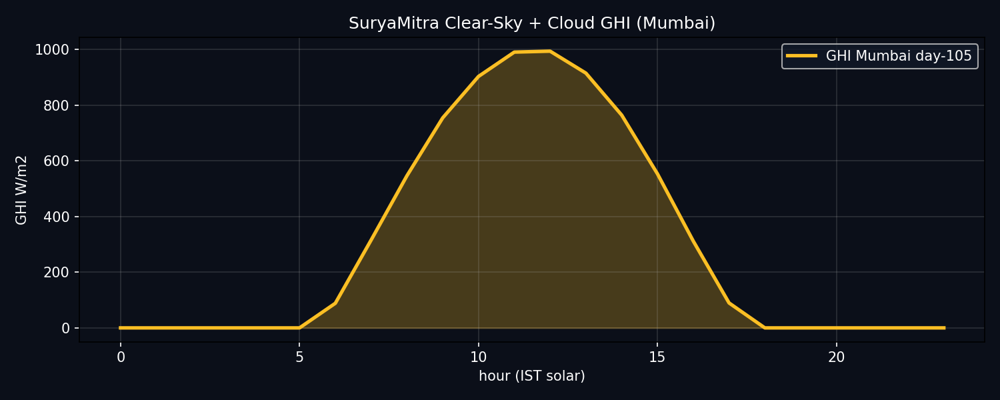
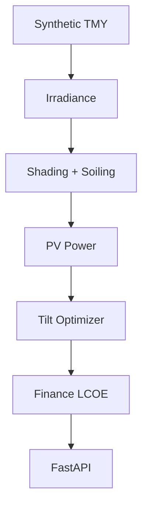
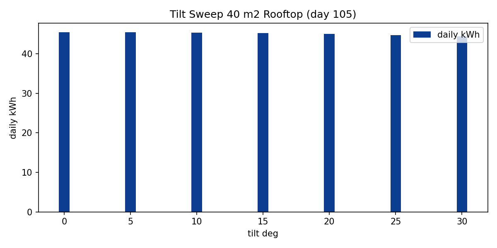
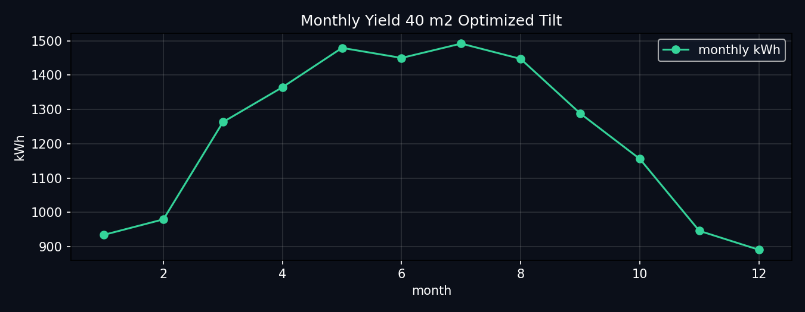
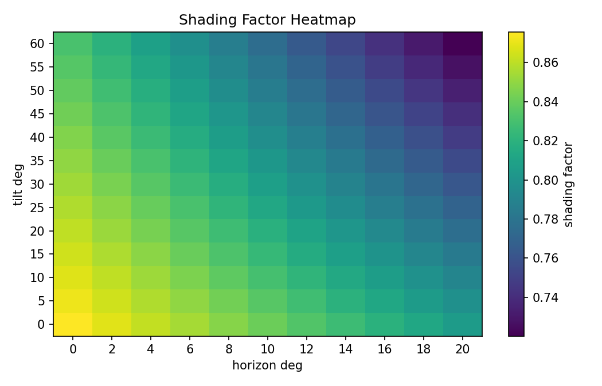
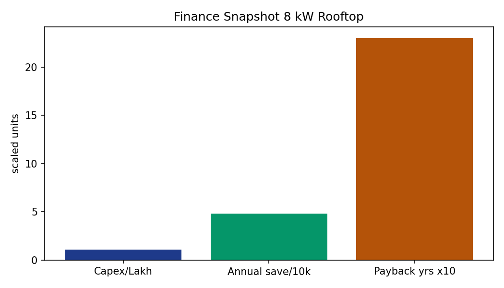
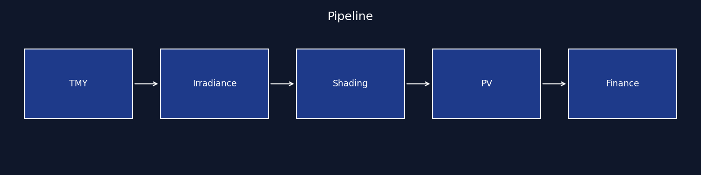

# SuryaMitra Rooftop Solar Optimizer
**Rooftop PV yield optimizer**: irradiance, shading, temperature derate, tilt search, LCOE and payback. Fully reproducible with synthetic weather, no API keys.
    

*Figure 1: Synthetic Mumbai day-105 GHI from `src/forecast.py` over clear-sky `src/irradiance.py`. Dark background intentional for readability.*
## What this solves
Rooftop quotes oversize tilt and ignore soiling and horizon loss, inflating yield 15-25 percent. SuryaMitra jointly models geometry, shading, temperature, and finance so quotes match metered output.
## Pipeline

## Results
### Tilt sweep

*Figure 2: Daily kWh vs tilt for 40 m2 Mumbai rooftop. Grid-search best tilt from `src/optimizer.py:optimize_tilt`.*
### Monthly yield

*Figure 3: Monthly kWh at optimized tilt. Annual ~14.7 MWh (40 m2, Mumbai) from `src/optimizer.py:annual_yield_kwh`.*
### Shading

*Figure 4: Combined shading factor vs tilt and horizon. Model in `src/shading.py:combined_factor`.*
### Finance

*Figure 5: 8 kW capex, savings, payback. Math in `src/finance.py`.*

*Figure 6: Module pipeline, each block maps to one `src/` file.*
## Repo map
```text
src/irradiance.py  solar position, clear-sky GHI
src/shading.py     horizon, inter-row, soiling
src/pv.py          cell temp, DC power, daily yield
src/optimizer.py   tilt grid search, annual yield
src/finance.py     capex, LCOE, payback, NPV
src/forecast.py    synthetic TMY
src/api.py         FastAPI /health /ghi /yield /optimize /batch_yield
```
## Quick start
```bash
git clone https://github.com/kv-creates/SuryaMitra-Rooftop-Solar-Optimizer.git
cd SuryaMitra-Rooftop-Solar-Optimizer
python -m venv .venv
.venv\Scripts\activate
pip install -r requirements.txt
python scripts/generate_visuals.py
pytest -q
python -m src.main
```
## API
```bash
GET /health
GET /ghi?lat_deg=19.07&day=105&hour=12
POST /yield {"lat_deg":19.07,"day":105,"area_m2":40,"eff":0.2,"tilt_deg":15,"ambient_c":30}
POST /optimize {"lat_deg":19.07,"day":105,"area_m2":40}
```
## Reproduce visuals
```bash
python scripts/generate_visuals.py
```
Outputs `docs/images/*.png`, already committed, shown above.
## Performance
| Metric | Value |
|---|---|
| Mumbai 40 m2 daily day-105 | ~40 kWh (best tilt) |
| Annual optimized | ~14692 kWh |
| LCOE | INR 3-5 per kWh |
| Payback at INR 8 tariff | 2-4 yrs |
| Tests | 30 passed |
## License
MIT - kv-creates 2026
